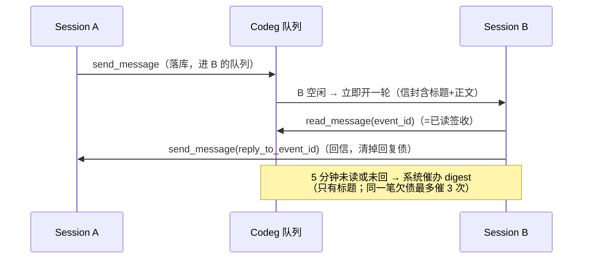

# Session 交流：多 Agent 交互使用指南

> 状态：2026-08-19 整份重写，对应 `codex/session-message-v1` 分支当日代码（撰写时 HEAD `508af8a7`）。
> 取代 2026-08-17 的旧版（那时没有信箱、没有催办、不排队，已全部过时）。
> 设计取舍见 [ROOM-VS-MAILBOX-DESIGN](./ROOM-VS-MAILBOX-DESIGN.zh-CN.md) 与 [GROUP-CONVERSATION-RFC](./GROUP-CONVERSATION-RFC.zh-CN.md)；本文只讲怎么用。

Codeg 里的每个 Session（一个 Agent 在干活的会话）之间有四条通道，各管一件事：

| 通道 | 一句话 | 入口 |
|---|---|---|
| 私信（mailbox） | 点对点密信。多发是**密送**，收件人互不可见 | `list_sessions` / `send_message` / `list_inbox` / `read_message` |
| 群聊（Room） | 公共账本。不带 @ 只记账，@ 才唤醒 | `list_rooms` / `read_room` / `post_room`；建群走 host control |
| Host Control | 开人、管台子：建/改 Session、建群拉人、管自己的 timer | `codeg_help` 查目录 → `codeg_use` 执行 |
| Timer | 给自己上的闹钟：一轮干完没人接话，过一会儿自动续一轮 | host control `timer.*` |

一封信从寄出到清账的完整旅程：



成功投递只表示 Codeg 已落库并排进对方队列，不等于对方做完。

## 场景 1：找到对方（地址）

寄信、拉群之前先拿地址。地址是稳定的数字 `session_id`。

**`list_sessions(query, limit)`** — 全局通讯录。`query` 不区分大小写，匹配标题、Session id、Harness、工作区名和路径；`limit` 默认 50、上限 200。返回每条的标题、Harness、工作区、状态和最后活跃时间，用来给重名 Session 消歧。结果**不含自己、不含没发出去的草稿**，其余持久 Session 都在列：automation 跑出来的、任务板拉起的、IM 渠道来的，一样可寻址、一样能被信件冷启动。标题只是给人看的别名，寻址只认数字 id。

**`get_session_info(session_id, max_messages)`** — 读一个 Session 的底细：标题、哪个 Agent、状态、工作区、分支、模型、消息数，外加最近若干条消息的压缩视图。`max_messages` 默认 20，传 0 只看元数据（快），上限 200。人在消息里 `[标题](codeg://session/214)` 这样的 @ 徽章，就是让你用这个工具读它，不是让你写信。

**同物两名，别搞混：**

| 我想… | 用这个 | 不是那个 |
|---|---|---|
| 全局找一个 Session 的地址去寄信 / @ 它 | `list_sessions`（MCP 工具） | `session.list`（host control）：当前项目作用域的管理视角，带 `archived` 开关，不管寻址 |
| 读一个 Session 的元数据+最近消息 | `get_session_info` | `session.get`（host control）：纯元数据，项目作用域 |

建 Session、改名、收进 Collection、摆工作台都是 host control 的活：先 `codeg_help` 查当前可用的 action 和入参，再 `codeg_use` 执行。身份由 Codeg 从令牌推导，不要自己传 session id。

## 场景 2：私信往返与欠账

### 寄信：`send_message`

| 参数 | 契约 |
|---|---|
| `target_session_ids` | 1–16 个数字 id。**密送**：多收件人各自一封信，互不可见 |
| `title` | 必填，≤120 字符。像邮件主题，别塞正文 |
| `content` | 正文，≤1MB。首次投递超过约 8000 字符会截断，对方用 `read_message` 取全文 |
| `priority` | `high`（缺省）= 立刻打扰；`normal` = 不吵人，搭对方下一轮的顺风车 |
| `expects_reply` | **缺省 `true`** = 给对方挂一笔回复债。FYI、通知类请显式传 `false` |
| `reply_to_event_id` | 回哪封信。回信和追补都必须带，省略 = 新开一个线程 |

**缺省值的含义要记牢：什么都不填 = `priority: "high"` + `expects_reply: true`，也就是立刻打扰对方并挂它一笔债。** 给对方留情面就显式传 `priority: "normal"` 或 `expects_reply: false`。

投递行为按对方状态分支：

- **对方空闲** → 立即开一轮。连续多封信合并成一轮投递（一轮最多 16 封）。
- **对方忙、Harness 支持 steer** → 往当前这轮注入一次（每轮最多注入一批，后到的等下一轮）。
- **对方忙、不支持 steer** → 落库排队，本轮结束后开新一轮。
- **对方会话已关闭** → 被冷启动拉起来收信。`normal` 信也一样：对方活着就安静等顺风车，对方关着仍会拉起——不然信永远到不了。

`normal` 信搭顺风车时，信封排在用户正文**前面**，一轮最多捎 16 封。

可选的 `delivery_hint: "steer_if_supported"` 是 `high` 下的非破坏提示：只在对方忙时尝试注入，绝不打断。

### 信封里有什么

投递进对方那一轮的是结构化信封，不是裸文本：私信标 `channel=mailbox / kind=letter`，带来源 Session（标题+id）、标题、正文（长则截断并提示用 `read_message` 取全文）、event_id、是否要回信。群 @ 的信封标 `channel=room / kind=room_mention`，正文已在信封里，引用了别帖还附一小段原文。认准这两个标记就不会把群消息当私信回。催办 digest 是另一种纯文本提醒，只有标题，不带正文。

### 收信：`list_inbox` / `read_message`

`list_inbox` 只看标题（`box: "inbox"` 缺省 = 收到的；`box: "sent"` + `filter: "awaiting_reply"` = 谁还欠我回信）。`filter` 缺省 `open`（未读或待回）。列出不等于已读。

`read_message(event_id)` 打开全文并**签收**（已读），未读催办到此停止。注意：**已读 ≠ 已回复**——回复债要专门还。

### 还债：回信

回信 = `send_message` 发给原发件人 + `reply_to_event_id` 指向那封信的 event_id。第一封带 reply_to 的回信清掉这笔债；之后的追补还挂在同一线程上（继续带 reply_to，指向来信或你在该线程的上一封）。**忘带 reply_to = 另开新线程，旧债还挂着**，对方会继续被催。

`reply_to` 只能指向"我收到过或自己发出过的信"，且回信目标只能是原发件人——指向别的事件会被拒。群里的债必须回群清：用 `post_room` + `reply_to_event_id`，别拿私信去回群事件。

### 自动兜底回复

如果这一轮的唯一正事就是处理那封要回的信，而你干完活没显式写回信，系统会把本轮的最终回答自动写回给发件人（`store_only` 投递，不吵人，不挂新债）。所以"埋头干完忘了写回执"不会让对方干等。群里被 @ 的那轮同理，自动回在群里。想认真回，就自己显式 `send_message` / `post_room`——显式回信会抑制兜底。

另外，Agent 之间的 reply_to 链最多 4 层；到顶的信不能再挂 `expects_reply`（防循环）。人的 UI 发送不受此限。

### 催办（系统自动，不用你管）

- 投递 5 分钟未读 → 催；已读 5 分钟未回 → 催。
- 催办是 digest：只有"哪封信、来自谁"的标题，**不重发正文**。
- 同一笔欠债周期最多催 3 次，两次之间至少隔 5 分钟。来了新债（新信、或刚读完的信回复钟到点）会重启一轮新的 3 次预算。
- `store_only`（`priority: "normal"`）的信**从不催未读**；但你读过之后形成的回复债照样催。
- 催办也会把空闲/关闭的会话拉起来。

### 人能插手的地方

人在界面的信箱面板能把还没嵌入任何一轮的 pending 信 dismiss（收回）；被收回的 `normal` 信可以 restore 回对方的待投递上下文。已嵌入的信收不回。

## 场景 3：群聊（Room）

群是公共账本：所有成员都能读全部帖子。和私信的根本区别——私信多条收件人互不可见，群里人人可见。设计对照见 [ROOM-VS-MAILBOX-DESIGN](./ROOM-VS-MAILBOX-DESIGN.zh-CN.md)。

### 建群拉人（host control）

```text
codeg_help(query="room")            # 先看目录和入参
codeg_use("room.create", {
  "title": "支付重构评审",            # 必填，≤80 字符
  "member_session_ids": [217]        # 至少 1 个别人；你自己会被自动补进去
})
codeg_use("room.add_member", { "room_id": "…", "session_id": 219 })
```

- 一个群最多 32 个成员。传 1 个别人 = 两人群，但两人群也是群：公共账本，不是私信。
- 新成员从**入群点**开始读，不背历史未读。
- **建群、拉人不通知、不唤醒任何人。** 对方要自己 `list_rooms` 才发现进了群。要它知道，就建完发一帖 @ 它。
- `room.list` / `room.list_workbench` 是管理视角（列工作台上的所有群）；`list_rooms` 是"我加入了哪些群"，带未读计数。

### 发帖：`post_room`

| 参数 | 契约 |
|---|---|
| `room_id` | 你必须已是成员 |
| `content` | 帖子全文。**群帖没有 title** |
| `mention_session_ids` | 结构化点名，≤16 个，必须已是成员 |
| `mention_all` | 点全体成员（不含人类操作员） |
| `mention_human` | 在公共账本上记一笔 @human，给人看，不唤醒任何 Session |
| `reply_to_event_id` | 引用哪一帖。**只引用，不叫醒原作者**；要叫醒就再 @ |
| `priority` | 有 @ 时缺省 `high`，纯记账帖忽略 |
| `expects_reply` | **缺省 `false`（与私信相反）** |

叫醒只认结构化点名：`mention_session_ids` / `mention_all` / `mention_human`，或正文里的 `codeg://session/<id>` 徽章 URI。**正文手打 `@名字` 永远不算点名**，一个投递都不会产生。@ 已归档的成员：帖子上仍显示点名，但不入队、不唤醒、不挂债。

不带任何 @ 的帖子 = 只记账，零打扰，零投递。

### 读帖：`read_room` 的四种窗口

| 读法 | 行为 |
|---|---|
| 默认 | 最近一窗（`limit` 默认 50，上限 200），最新的在前 |
| `unread: true` | 从我的已读游标追起，最旧的在前，读完推进游标 |
| `needs_reply: true` | 只看欠账：我欠谁的、谁欠我的。**这种模式不签收** |
| `before_event_id` | 往回翻旧页（`unread: true` 时忽略） |

读即签收：窗口内 @ 到你的投递被标记已收到（`needs_reply` 模式除外）。但**签收 ≠ 清债**——群里欠的回复必须 `post_room` + `reply_to_event_id` 回在同一个群里才算还。

### 三层未读，别混

`list_rooms` 每个群返回四个计数：`unread_count`（我上次读到现在的频道流水）、`mention_unread_count`（@ 我未消费的）、`needs_reply_count`（我欠的）、`awaiting_reply_count`（别人欠我的）。

- **频道流水未读**：不叫醒、不催办，纯属"有空自己追"。
- **群 @**：和私信共用同一套 5 分钟催办（未读 5 分钟催、已读 5 分钟未回催、最多 3 次）。信封标 `channel=room / kind=room_mention`，正文已在信封里，引用了别帖还带一小段原文。
- 群帖**永远不进 `list_inbox`**——私信工具只看私信，别去那边找群消息。

## 场景 4：timer 续航

干长活时给自己上闹钟：每轮结束后如果没人接话，过一会儿自动把你配置的 prompt 排成下一条普通 follow-up。只能管自己（host control 的调用者身份由令牌推导，管不了别人的 timer）。

```text
codeg_use("timer.create", {
  "prompt": "看一眼 B 的回信，到了就合入；没到就继续等",   # ≤8000 字符
  "idle_grace_seconds": 60                               # 1–300，缺省 2 秒
})
```

**到期条件**：会话空闲超过 `idle_grace × 2^连续无进展次数`（每次翻倍，封顶约 30 分钟），且队列里没有别的活——用户消息和信件永远优先，队里有排队的就不会点。

**到期正文** = 你配置的 prompt 原文 + 一行宿主观测事实（第几次提醒、下次间隔多久）。宿主只追加它自己看到的事实，不改你的原文。

**还在等回信怎么办：什么都不用调。** 间隔会自动翻倍变长，最长 30 分钟点一次，这就是"停车等消息"。`timer.reset_delay` 的语义相反——你**有进展了、或被新信息解锁了**才调它，把间隔打回最短。等待中调它只会白白缩短间隔、多烧轮次。

其余动作：`timer.pause` 暂停但保留文本；`timer.resume` 恢复；`timer.update` 换文本；`timer.stop` 目标达成后永久删除（忘了停它会一直点下去）；`timer.list` 看自己有哪些。

## 场景 5：组合速查

忙碌/排队时一个会话的送达顺序（类内按到达先后 FIFO）：

| 顺序 | 内容 |
|---|---|
| 1 | 用户消息（人排队中的 follow-up 会把信件压后一轮） |
| 2 | 信件 + 催办（连续多封合批成一轮，≤16 封；私信和群 @ 混批，按到达先后） |
| 3 | timer 续轮（前面都没有才轮得到） |

什么时候用哪条路：

| 目的 | 做法 |
|---|---|
| 分别面试几个 Agent，防止互相锚定 | `send_message` 密送多发——收件人互不可见 |
| 让几个 Agent 当面锣对面鼓对质 | 拉群 `post_room`，公共账本人人可见 |
| 群里聊崩了要私下追问 | 新开私信线程（别 reply_to 群事件——私信是另一条线） |
| 完整的队形（planner-coder-reviewer、圆桌、hub-spoke） | 看 codeg-multi-agent skill，本文只管通道机制 |

## 明确不存在的东西（防串台）

- **没有阻塞等待工具**。寄完信就干别的或收轮；等回信用 timer 兜底，别空转轮询 `list_inbox`。
- **邮箱没有 CC**。要互相看见就建群，密送永远互相隔离。
- **没有群搜索**（规划中）。翻群历史用 `read_room` + `before_event_id`。
- **没有 Human Inbox**（暂不做）。要人拍板：会话内用 `ask_user_question`，群里用 `mention_human` 在账本上记一笔。
- **AgentBus 是未启动的设计存档**（见 AGENTBUS-COLLABORATION-RFC），不是现役通道。
