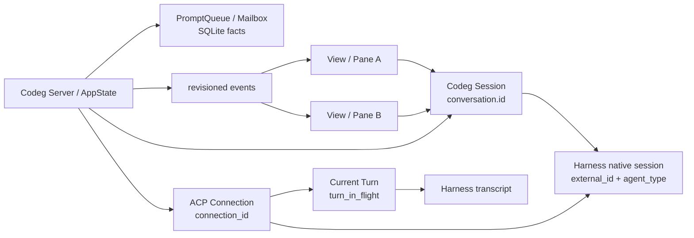
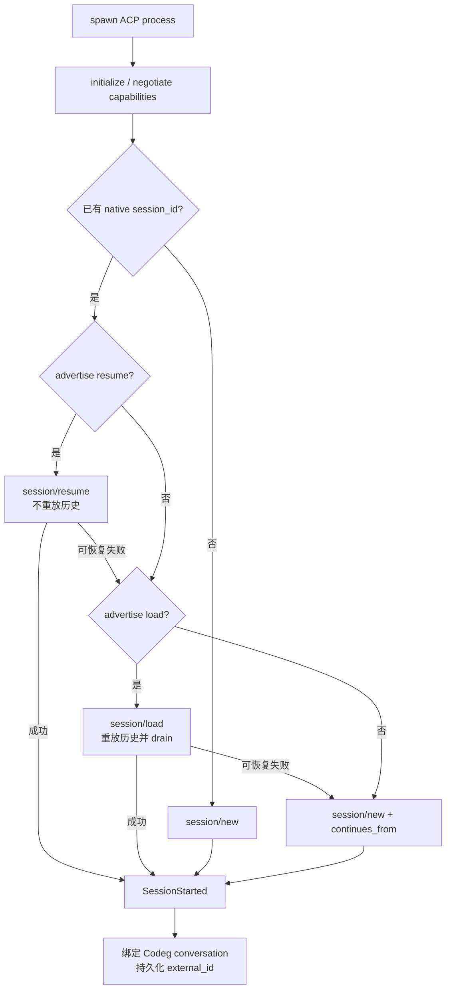
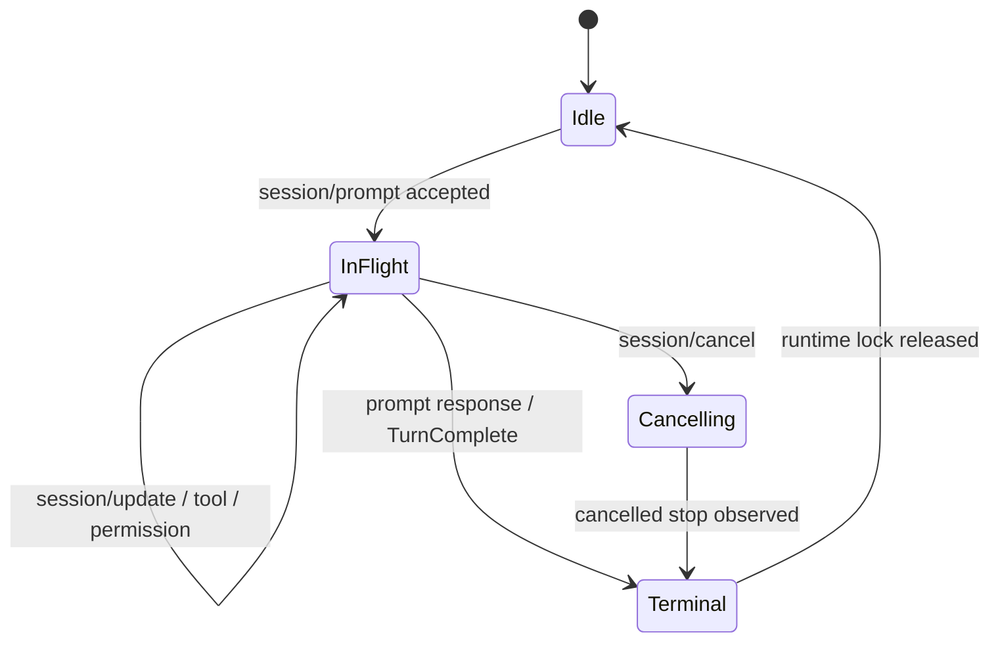
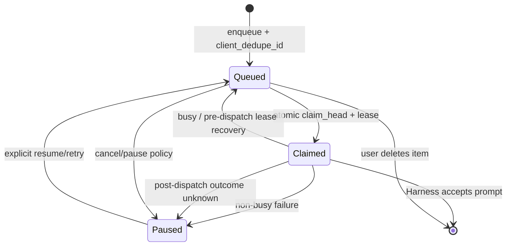
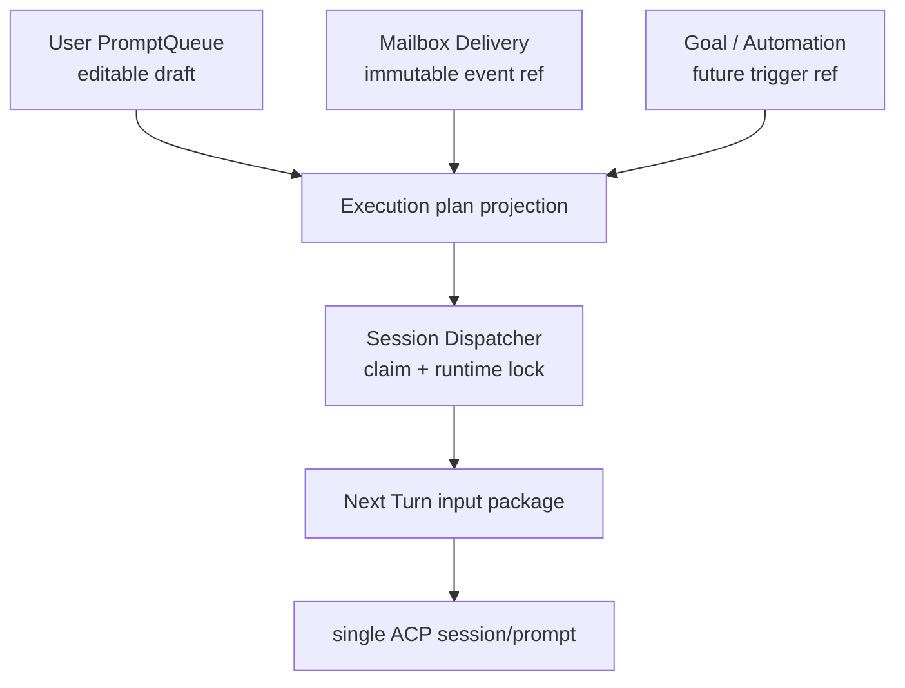
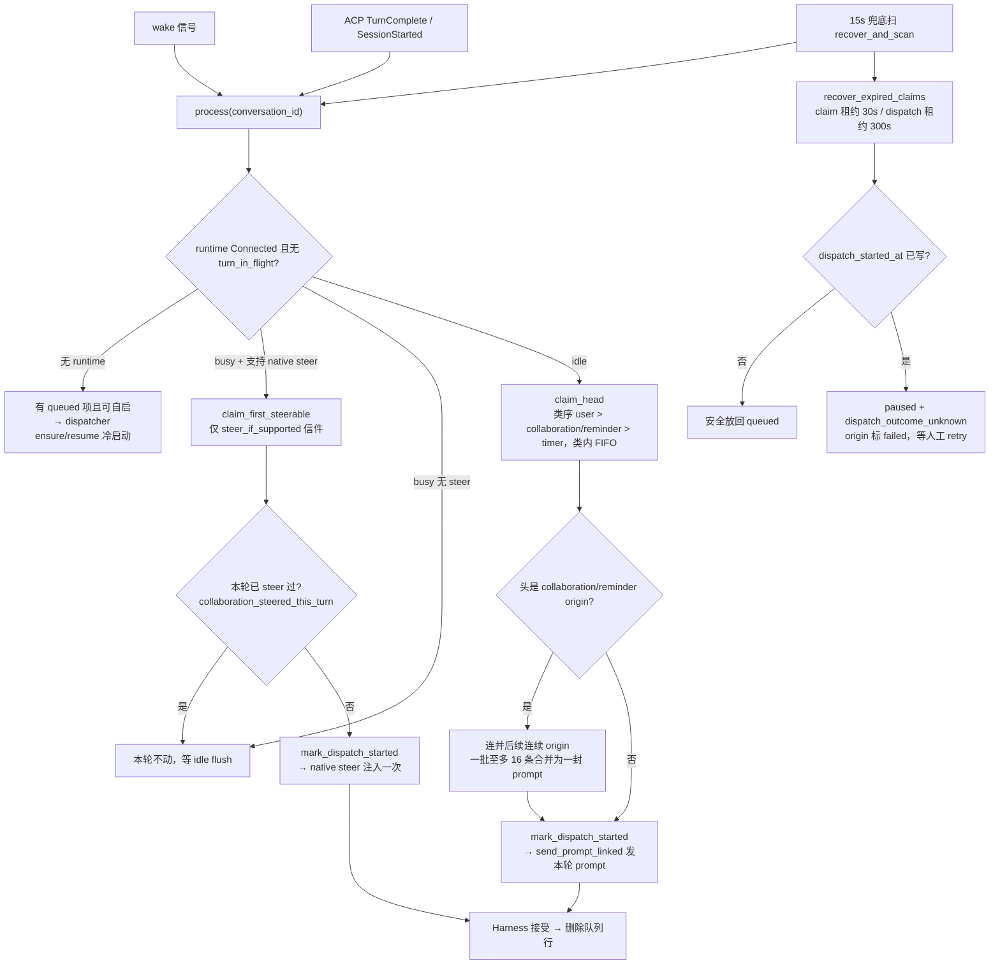
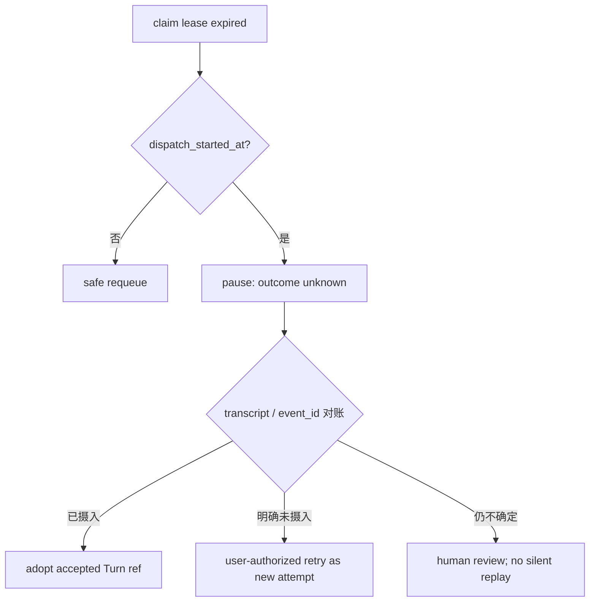
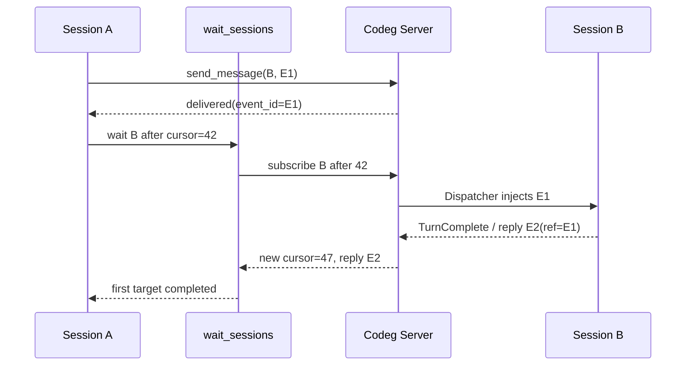
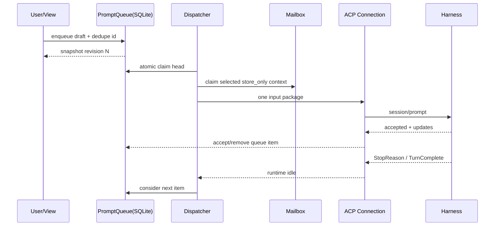

# Codeg Session Runtime 生命周期 RFC

> 状态：语义基线；Fork 身份批次已实现，其余拟议能力仍受实施 Gate 约束
>
> 审计基线：2026-08-16，`codex/session-workbench-foundation`，Fork 实现提交 `0bfb86a0`
>
> 相邻文档：[Session 间通信与调用策略 RFC](./SESSION-COMMUNICATION-RFC.zh-CN.md)、
> [领域模型](./DOMAIN-MODEL.zh-CN.md)、
> [Workbench 层级、多窗口与 Session 多视图同步 RFC](./WORKBENCH-LAYOUT-SYNC-RFC.zh-CN.md)、
> [Host 控制面 RFC](./HOST-CONTROL-SURFACE-RFC.zh-CN.md)、
> [Session Triggers、Goals 与 Automation RFC](./SESSION-TRIGGERS-GOALS-AUTOMATION-RFC.zh-CN.md)

本文只统一 Codeg 中 Session、ACP、Turn、用户 follow-up、跨 Session Mailbox 和未来等待能力的
生命周期语义。通信正文、Reminder 字段和 UI 投影的详细设计仍由
[Session 通信 RFC](./SESSION-COMMUNICATION-RFC.zh-CN.md)负责；本文不复制完整 schema。

## 1. 阅读方法和状态标记

本文对每个结论使用四种状态，禁止把目标设计写成当前事实：

- **【当前事实】**：已由当前源码、迁移或上游协议核实；
- **【已审计缺陷】**：当前行为与长期语义存在缺口，或只能提供较弱保证；
- **【拟议设计】**：后续可以实现，但本轮没有代码授权；
- **【未决问题】**：继续实现前必须由产品和工程共同裁决。

“Session 完成”“消息送达”“Agent 看见”“Turn 结束”是四件不同的事。本文最重要的目的就是
阻止它们继续共用一个含混的 `done/read/completed`。

## 2. 身份：谁可以被稳定寻址

### 2.1 三种 ID 不得混用

| 对象 | 当前标识 | 生命周期 | 用途 |
|---|---|---|---|
| Codeg Session | 当前 Backend 内的 `conversation.id: i32` | 持久 | UI、Collection、Workbench、通信寻址 |
| Harness native session | `conversation.external_id` + `agent_type` | Provider/Harness 管理 | ACP Resume/Load、导入和原生能力 |
| ACP connection | `connection_id` | 一次运行连接 | 当前进程、流式事件、prompt/cancel |
| Turn | 当前连接内的一次 `session/prompt` 请求及其结果 | 短暂，但应能回指 transcript | 一轮用户/自动输入与 Agent 输出 |
| View/Pane | Window/Workbench 内的视图引用 | 可随时创建和关闭 | 展示同一 Session，不是 Session 本身 |

**【当前事实】** `conversation.external_id` 在数据库中不是全局唯一身份；当前管理器按
`(external_id, agent_type)` 查找原生活跃连接。Codeg 内部 direct 通信目前以同一 Backend 的
`conversation.id` 寻址。

**【拟议设计】** 对外公开的稳定地址统一写作：

```text
SessionAddress = (backend_ref, conversation_id)
```

单 Backend UI 可以继续只传 `conversation_id`，但协议、深链、远端 View 和 MCP 不应假设裸
整数跨 Backend 唯一。`external_id` 只负责找回 Harness 原生历史，不能替代 Codeg 地址。

### 2.2 名字、角色与 @ 自动补全

**【拟议设计】** 标题、角色、群昵称和 AgentBus role 都只是别名：

1. 用户输入 `@文献调研 GPT`；
2. 自动补全列出标题、Harness、cwd/Collection、Backend、最近活动和短 ID；
3. 用户选中后，草稿保存稳定 `SessionAddress`，显示文本仍可保留人类名称；
4. 真正发送时只按地址路由，并记录发送时的 `title_snapshot` 等展示快照。

因此：

- 重命名只改变当前展示，不改变已解析的目标；
- 重名合法，必须在选择器中消歧，不能“取第一个同名 Session”；
- 发送后的审计卡优先显示当前标题；当前 Session 已不可用时回退到发送时快照；
- 归档只是库视图状态，地址和 Resume 能力仍应保留；
- 软删除不回收 ID，历史 event/Delivery 仍保留发送时快照；是否允许向已删除目标新发消息需明确拒绝；
- 一次 fan-out 保存多个稳定目标，而不是保存一串稍后再解析的名称。

**【当前事实】** 当前 `collaboration_event`/Delivery 已保存来源和目标的标题、Harness、路径、
Backend 快照；迁移有意避免让来源删除级联抹掉已送达邮件。`conversation.archived_at` 与
`deleted_at`、运行状态、Workbench 引用彼此独立。

### 2.3 Fork：历史身份不可变，活动 View 显式 handoff

**【当前事实】** 提交 `0bfb86a0` 已将 `ConnectionManager::fork_session`、
`persist_fork_outcome` 与前端 Runtime store 调整为：

```text
Fork 前：Codeg C1 → native S1

Fork 后：Codeg C1 → native S1（原历史与通信身份保持不变）
        Codeg C2 → native S2（新分支、新稳定地址）

触发 Fork 的 View：C1 → C2
其他已经打开 C1 的 View：仍然引用 C1
```

Fork API 显式返回原/新 Codeg ID、原/新 native ID 和 handoff 信息；连接在 C2 持久化完成前不会
公开 `session_started`，避免出现 C1 短暂指向 S2 的窗口。C2 可以继承 Harness、cwd、必要模型配置、
Collection 和静态展示信息，但不会继承 PromptQueue、Mailbox Delivery、Attention/Obligation、
Reminder、WaitSubscription、草稿或正在运行的 Turn。旧数据保持原有解释，不做猜测式重写。

这项裁决同时保留两种用户直觉：稳定地址永远指向同一逻辑历史；发起 Fork 的用户仍自然地继续
操作新分支。`parent_id` 继续表示来源/委派关系，不承担 Fork lineage 或身份替换。

## 3. 所有权：前端不是运行时事实源

### 3.1 对象关系



### 3.2 权威来源矩阵

| 事实 | 权威所有者 | 不应成为权威的对象 |
|---|---|---|
| Session 标识、标题、归档、native ref | Codeg SQLite | 某个 Pane 的 React/Zustand 状态 |
| 待发送 follow-up | SQLite PromptQueue | 仅挂载在聊天面板里的 effect |
| 跨 Session 正文和 Delivery | SQLite Collaboration Event/Delivery | 两端各复制一份消息 |
| 当前连接与 Turn 锁 | `ConnectionManager` / `SessionState` | 每个窗口各启动一个 Harness |
| Agent 实际看过的输入 | Harness transcript + turn ref | `ui_seen_at` 或 Inbox 被打开 |
| 布局、打开位置 | Workbench/Window 持久状态 | Session transcript |
| 滚动、悬浮、拖拽中的位置 | 当前 View | 后端全局广播 |

**【当前事实】** `SessionState` 是每个活跃 ACP connection 的运行态，保存 `conversation_id`、
`external_id`、cwd、`owner_window_label`、连接状态、实时消息/工具/权限状态、事件序号与 ring buffer、
`turn_in_flight`。它不是持久 Session 本身；进程消失后由 SQLite 与原生 Session 负责恢复。

**【当前事实】** 一个 Session 可以有多个 View；队列和协作 revision 由后端广播。任何 View 关闭
都不应删除持久消息。物理窗口关闭是否同时断开其 owner connection 仍由当前 Host 生命周期策略
决定，但 SQLite 项不会因此消失。

## 4. ACP Session 与 Turn 的当前生命周期

ACP 官方顺序是 `initialize` 后创建或恢复 Session，再以 `session/prompt` 开始 Turn，期间通过
`session/update` 流式更新，原 prompt 请求返回 StopReason 时该 Turn 结束；`session/cancel` 是
取消通知而不是新的 Session。参见 [Protocol overview](https://agentclientprotocol.com/protocol/v1/overview)、
[Session setup](https://agentclientprotocol.com/protocol/v1/session-setup)、
[Prompt turn](https://agentclientprotocol.com/protocol/v1/prompt-turn) 和
[Cancellation](https://agentclientprotocol.com/protocol/v1/cancellation)。

### 4.1 连接与恢复

**【当前事实】** `run_connection` 的实际流程为：



- `initialize` 的 capability 决定是否允许 `load`、`resume`、Fork、原生 steering 等；
- 有原生 ID 时优先 `session/resume`，成功后不消费历史 replay；
- resume 可恢复失败再尝试 `session/load`；load 只有声明 capability 时才发送；
- 对已忘记或不支持恢复的 Harness，可新建 Session 并以 `continues_from` 关联 Codeg 历史；
- `SessionStarted` 通过有序 lifecycle worker 把 native ID 写回已绑定的 Conversation，并广播更新。

“Load 失败就新建”不是对所有错误无条件成立；认证、协议或不可恢复错误需要暴露，不能静默丢失
原生连续性。

### 4.2 Prompt、Turn 与完成

**【当前事实】** `ConnectionManager` 为每个 connection 维护 `prompt_lock` 和
`SessionState.turn_in_flight`：

1. 所有 prompt ingress 在同一锁内检查持久队列准入，不能绕过已经排队的 head；
2. 被接受的 prompt 在写入命令通道前将 `turn_in_flight=true`；
3. `UserMessage` 记录待完成的用户消息 ID；
4. Harness 的流式 update 更新 live message/tool/permission 状态；
5. `TurnComplete` 捕获完成的用户消息引用和助手正文，清理 live state，并令
   `turn_in_flight=false`；
6. lifecycle worker 再把 Codeg Conversation 写为 `PendingReview` 或 `Cancelled` 等状态。



**【当前事实】** `ConversationStatus::Completed` 不是 ACP Turn 的同义词。普通 Turn 成功结束通常
进入 `PendingReview`；拒绝、超限、未知/空结果等可进入 `Cancelled`；“Completed”属于更高层的
用户/产品状态。文档和 UI 不应把 `TurnComplete` 翻译成“整个 Session 任务完成”。

### 4.3 Cancel、Stop、断开

- **Cancel 当前 Turn**：`acp_cancel_core` 先暂停仍待发送的 follow-up，再调用
  `ConnectionManager::cancel`。取消当前 Turn 不授权队列自动继续；需要用户明确 Resume。
- **Stop 生成/工具结束**：属于该 Turn 的 terminal 结果，不等于删除 Session，也不清空 Mailbox。
- **关闭 View**：只应移除视图引用；持久队列仍在。当前连接是否保留取决于 owner window/Host 策略。
- **断开或进程错误**：生命周期 worker处理 terminal 状态；`InProgress` 会话可转为 `Cancelled`，
  但原生 Session 和 Codeg 行仍可用于恢复。
- **重启**：不恢复内存 connection；SQLite 队列、Conversation 和 Collaboration facts 继续存在。

### 4.4 离线唤醒采用按来源授权，而不是统一冷启动

**【已裁决、尚未完整实现】** “目标当前没有 Runtime”与“允许为这条消息启动 Runtime”必须分开：

- 用户在 Codeg UI 明确执行 `invoke` 时，可以冷启动受管且可恢复的 unloaded Session；
- Session/Agent 来源的 `invoke` 只有目标开启 `allow_background_wake`，或消息属于用户明确批准的
  协作关系/工作流时才可冷启动；V1 默认不授权；
- 用户主动 `stopped` 的 Session 永不被后台消息自动唤醒；
- `crashed/reconnecting` 必须先恢复并核对 Codeg/native binding，不能直接 claim 下一项；
- active idle 的 `invoke_when_idle` 可由 Dispatcher 正常执行；`store_only` 不单独创建 Turn。

这一策略只固定未来 Dispatcher 语义，不表示当前 direct Router 已提供全部冷启动策略字段。
（2026-08-19 对账：产品此后已授权需要送达的信在目标关闭时由统一 Dispatcher 启动/恢复，
见通信 RFC 6.1 的 2026-08-18/19 实现注记；本段其余约束仍成立。）

## 5. 用户 PromptQueue 生命周期

### 5.1 当前已经实现的事实

**【当前事实】** 当前队列已是后端权威、SQLite 持久化的 per-Session 队列，不再是旧版
`use-message-queue.ts` 的窗口内存 FIFO：

- `conversation_prompt_queue_state` 保存 revision 与整队暂停原因；
- `conversation_prompt_queue_item` 保存稳定 item ID、位置、可编辑 `PromptDraft` 或
  `origin_event_id`、mode、attempt、claim lease 和去重键；
- `draft_json XOR origin_event_id`，同 Session 用户 follow-up 与 mailbox 执行引用共用派发入口，
  但不共用正文事实；
- 前端 hook 只是 snapshot/event projection，断线后按 revision 重新拉取；
- 当前公开的持久 item 状态只有 `queued / claimed / paused`；
- 一个后端 worker 原子 claim FIFO head，并只通过 `ConnectionManager::send_prompt_linked` 派发；
- 已关闭 Session 存在队列项时，由统一 Dispatcher 冷启动/恢复后继续派发
  （`request_ensure_runtime` → `session_dispatcher::ensure_session_runtime`，2026-08-19 对账）。

因此，旧的“刷新丢队列、两个窗口各一份、只有聊天面板挂载时才能 flush”应作为**已修复的历史
缺陷**记录，不能继续写成当前限制。

### 5.2 当前存储状态机



接受 prompt 后删除队列行是有意设计：队列只拥有“尚未被 Harness 接受的输入”，Turn 后续状态由
ACP runtime/transcript 拥有。`dispatch_started_at` 是不可逆风险边界：

- claim 过期且尚未开始 dispatch，可以安全回到 `queued`；
- 已开始 dispatch 但未确认接受，不能静默重放，否则工具或外部副作用可能执行两次；
- 这类 item 进入 `paused`/`dispatch_outcome_unknown`，等待人工核对或 transcript 对账。

### 5.3 跨层语义投影，而不是扩充一个枚举

委托需求中的完整链条：

```text
queued → claimed → submitted/embedded → completed/failed/interrupted/cancelled
```

**【拟议设计】** 它应是多个事实源组成的生命周期投影，不应把所有状态硬塞回
`PromptQueueItemState`：

| 语义阶段 | 事实证据 |
|---|---|
| queued / claimed / paused | PromptQueue item + lease |
| submitted | `dispatch_started_at`，仅表示可能开始发送 |
| accepted/embedded | `send_prompt_linked` 接受、原生 transcript message ref；协作消息另有 `embedded_turn_ref` |
| turn_completed | ACP `TurnComplete` / transcript |
| failed | dispatch failure或 terminal lifecycle error |
| interrupted/cancelled | cancel operation + terminal Turn evidence |

已被 Harness 接受的用户 follow-up 即使 Turn 随后失败、中断或取消，也不能重新生成相同 queue item
自动发送。用户可以基于原消息显式“重试为新输入”，新输入必须获得新的幂等键和清楚的来源引用。

**【已审计缺陷】** 当前接受后删除 queue row 是正确的派发边界，但 UI/公共控制面还缺少一份把
已接受输入与后续 ACP Turn terminal 关联起来的统一只读投影；因此调用者不能只查队列表判断
“这条用户消息最后怎样结束”。

### 5.4 各类操作的精确定义

| 操作/故障 | 当前或拟议语义 |
|---|---|
| 暂停 | 队列仍持久存在，不再自动 claim；不取消当前 Turn |
| Stop/Cancel | 先暂停后续队列，再取消当前 Turn；不自动运行下一项 |
| 关闭最后 View | 不删除队列；无活跃 runtime 时等待正常 Resume，不冷启动 |
| App/Server 重启 | SQLite 恢复；过期 pre-dispatch claim 可重排，post-dispatch unknown 必须暂停 |
| 进程崩溃 | 与 lease 恢复相同；不能因无法确认接受而盲目重放 |
| 编辑/删除/排序 | 只允许未被当前 claim 锁定的 item；revision 冲突时刷新后重试 |
| 手工清空 | 当前只有逐项删除/暂停等能力；批量清空语义尚未定义 |
| Turn 完成 | 不再修改已删除的 queue row，由 ACP/Conversation/transcript 投影 |

**【未决问题】** 批量“清空”是否只删除 queued，还是也 dismiss 由 mailbox 映射的 execution
reference？答案必须保留原 collaboration event，不能把清空执行计划解释为删除邮件正文。

## 6. Mailbox 生命周期及其与 Turn 的边界

详细状态和 UI 见 [Session 通信 RFC 第 3、6、7 节](./SESSION-COMMUNICATION-RFC.zh-CN.md#3-三层事实模型)。
本文只固定跨运行时的共同语义。

### 6.1 当前事实与拟议层次

| 层 | 当前事实 | 后续拟议 |
|---|---|---|
| Event | 不可变正文、source snapshot、dedupe、reply_to | 继续作为唯一正文事实源 |
| Delivery | per-target `pending/queued/embedding/embedded/dismissed/failed` | 增加清晰的投递终态/恢复策略 |
| Attention | `attention_state` / `opened_at` 已进表（迁移 m20260816_000005，2026-08-19 对账），仍只表示人类 UI 投影 | — |
| Agent receipt | `agent_received_at` 已进表（同上）；`embedded_turn_ref` 仍是证据之一 | 未来 checkpoint 证据 |
| Obligation | `obligation_state`（`none/awaiting_reply/resolved`）已进表（同上） | `awaiting_ack` 待显式 ACK 协议 |
| Reminder | 已实现：5 秒一扫的 mailbox 催办（`collaboration_reminder_runtime.rs`，2026-08-19 对账） | 升级策略、通知发送者 |

**【当前事实】** `ui_seen_at` 不能证明 Agent 看过消息；真正摄入以 `embedded_turn_ref` 或未来等价
checkpoint evidence 为准。`expects_reply=false` 不能产生“已读未回”。回复是一个新的不可变 event，
通过 `reply_to_event_id` 精确清偿对应目标，不用发送方收到任意新消息来猜。

**【已修复，2026-08-19 对账】** 独立 Attention、Agent receipt 和 Obligation 已随迁移
m20260816_000005 进表（`attention_state` / `opened_at` / `agent_received_at` / `obligation_state`），
“UI 已打开但 Agent 未摄入”与“已摄入、待回复”均可表达。两套 deadline 未物化成列，由催办
扫描按常量时限现算（未读 / 已读未回各 300 秒）。

### 6.2 Reminder 不复制正文

**【拟议设计】** Reminder/escalation 永远引用同一 `event_id` 和 per-target Delivery：

```text
original event E1 ── delivery D1 ── awaiting_reply
                         ├── reminder R1(ref=D1)
                         ├── reminder R2(ref=D1)
                         └── escalation X1(ref=D1)
```

两套期限分离：

- `unread_due_at` 从 mailbox 对目标可见开始；
- `reply_due_at` 只从 Agent 真正摄入或明确 ACK 边界开始；
- 离线或 busy 可以显示 overdue，但不重复计数；
- cooldown、最大次数、目标级 digest 和稳定去重防止催促循环；
- 逾期和 `urgency=urgent` 默认只产生提示，不自动获得 cancel/interrupt 权。

## 7. 两套持久记录，一个 Dispatcher

### 7.1 为什么必须分开存

- 用户 follow-up 保存可编辑 `PromptDraft`、用户排序和模式；
- Mailbox 保存不可变 event、per-target Delivery、Attention、receipt、Obligation 和 reply chain；
- Reminder/Automation 保存自己的计划与审计；
- 它们不能合表，因为“编辑待发草稿”与“篡改已发送邮件正文”不是一回事。

### 7.2 为什么只能有一个 Turn 入口

**【当前事实】** 当前 PromptQueue runtime 已经承接普通 follow-up 和 `origin_event_id` mailbox
执行引用，并复用 `prompt_lock`、`turn_in_flight` 和队列准入；这已经是统一入口的第一步。

**【拟议设计】** 后续将多个事实源投影为一个可见 execution plan，由 backend-authoritative
Session Dispatcher 原子选择下一项：



默认调度顺序：

1. 当前正在运行的 Turn 不变；
2. 用户明确提交的 follow-up，遵循 FIFO/用户拖动顺序；
3. 普通 `invoke_when_idle` mailbox 执行项；
4. Goal、Automation 和 background work。

当前 PromptQueue runtime 的 claim 双路径与租约回收（2026-08-19 对账，与代码一致——
`prompt_queue.rs` 的 `process` / `process_native_steer` / `recover_and_scan`，
`prompt_queue_service.rs` 的 `claim_head` / `claim_first_steerable` /
`recover_expired_claims`）：



`store_only` mailbox 不是独立执行项。派发下一条自然用户 Prompt 时，Dispatcher 才按最旧优先、
条数与字节预算把选中的协作信封放在前面，用户正文放在最后：

```text
[mailbox envelope E1]
[mailbox envelope E2]
[current user prompt]
```

每封信保持自己的 `event_id` 和 obligation；一个普通最终回答不能自动清偿同一 Turn 批量附带的
所有邮件。只有显式 `reply_to_event_id`，或单一 mailbox 独占触发的 Turn，才能安全归因。

Urgency/overdue 只改变徽标和提供“插到下一条”操作。只有用户点击“停止当前任务并处理”，或命中
可审计的预授权策略，才允许走 interrupt operation；普通发送者无权自动取消目标。

## 8. 并发、恢复和多 View 同步

### 8.1 原子 claim 与 lease

任意可能创建 Turn 的来源都必须经过：

```text
read current revision
  → atomic claim(item, dispatcher_id, lease)
  → recheck runtime/cwd/turn lock
  → mark dispatch_started
  → submit once
  → accept or pause unknown
```

**【当前事实】** PromptQueue 已实现 per-Session revision、原子 `claim_head`、claim/dispatch lease、
client dedupe、接受后删除、busy 回队首、失败暂停和 post-dispatch unknown 防重放。

**【拟议设计】** Mailbox、Reminder、Automation 与未来跨 Backend Adapter 应复用同一个
Dispatcher claim，不得各自“看见空闲就发”。对同一执行引用，幂等键至少包含稳定 source、target、
原业务 event/item ID 和 operation kind；重连重试返回同一结果或可审计失败。

### 8.2 Revision 广播和多窗口

- Session 本体、队列、Mailbox 和执行计划是后端共享事实；
- 每次持久变更增加相应 revision，并向所有本地/远端 View 广播；
- View 忽略旧 revision，断线后按当前 revision 拉 snapshot；
- 两个窗口可以显示同一 Session，但不能各启动一份 native runtime；
- 布局、激活 Workbench、滚动和草稿保留范围仍按各自 owner 决定，不因共享 Session 被全局同步。

**【当前事实】** ACP live event 自身已有 event sequence 和 ring buffer，PromptQueue/Collaboration
已有 revisioned change event。它们是不同 domain 的 cursor，不能未经设计压成一个全局整数。

### 8.3 已提交后的中断与恢复

一旦 `dispatch_started_at` 已写入，就不能假定 Harness 没收到。崩溃恢复顺序应为：



当前 PromptQueue 已实现“pre-dispatch 可恢复、post-dispatch 暂停”这一底线；自动 transcript 对账、
统一 Turn ref 和跨 Provider 幂等仍是拟议。

## 9. `wait_sessions` / `wait_threads`：Optional/Later 的宿主等待点

**【当前事实】** Codeg 当前源码没有 `wait_sessions` 或 `wait_threads` 公共能力。AgentBus 的
`recv --wait` 属于未托管边界，不代表 Codeg 内部必须让 Agent 常驻阻塞。

**【裁决】** 这不是近期通信正确性依赖，也不是普通 Agent 协作的默认路径。Codex 一类宿主的
wait 能力本质是订阅目标状态，满足 completion、attention 或 user-input 条件后返回紧凑 snapshot/
final；它不持续读取对方完整 transcript。读取历史与 ctx 搜索属于另一能力。

**【拟议设计 / Optional Later】** 未来若 Goal、Automation 或显式 fan-in 确实需要等待，等待工具只
观察异步任务，不保存消息、不负责调度、不维持可靠性：

```text
wait_sessions(
  targets: [{session_address, after_cursor}],
  return_when: first | all,
  timeout_ms,
  wake_on_user_input: true
)
```

语义要求：

- `after_cursor` 抑制调用者已经见过的 terminal/update，不靠读取整段 transcript 猜；
- `first` 在任一目标达到新 terminal/needs-attention 时返回；`all` 等到全部目标越过各自 cursor；
- timeout 返回当前 snapshot，不把 timeout 记成目标失败；
- 等待中的来源 Session 收到用户新输入时，以 `user_input` 原因立即返回，让用户重新取得控制；
- 等待 API 是宿主 run state 中可恢复的订阅边界，不能作为普通 ACP Turn 内的长时 MCP 调用占用
  prompt lock、connection 或模型调用；
- Session 即使无人 wait，Mailbox 仍可靠落库，Dispatcher 仍按策略运行；
- Goal/Automation fan-in 将 continuation、cursor 和等待条件持久化到宿主 run state，事件到达后再
  恢复；wait 本身不创建 Goal、不唤醒目标、不清偿 obligation；
- 普通协作采用 Mailbox + Obligation + Dispatcher 的 event-driven continuation。ctx 仅在遗忘后
  检索历史，不承担可靠投递、UI Attention 或待回复义务。



**【未决问题】** cursor 是 Session lifecycle cursor、collaboration revision，还是带 domain 的复合
cursor？推荐显式复合 cursor，避免把消息到达和 TurnComplete 混成同一种事件序号，但需在工具
接口设计批次进一步验证。

## 10. 两条端到端主链

### 10.1 用户消息到 Turn



关键边界：queue row 的删除表示“prompt 被接受”，不是“Turn 成功”；Mailbox `embedded` 表示正文
进入了可回指 Turn，不是“Agent 已回复”。

### 10.2 Session A 发信、B 摄入并回复

```mermaid
sequenceDiagram
    participant A as Session A
    participant R as Collaboration Router
    participant DB as Event/Delivery(SQLite)
    participant B as Session B Dispatcher
    participant HB as B Harness
    A->>R: send E1 to stable B address
    R->>DB: persist E1 + delivery D1
    DB-->>A: delivered / queued projection
    B->>DB: claim D1 or execution ref
    B->>HB: envelope(E1) + prompt
    HB-->>B: TurnComplete
    B->>DB: embedded_turn_ref + agent receipt
    HB->>R: send reply E2, reply_to=E1
    R->>DB: persist E2; resolve D1 obligation
    DB-->>A: revision changed / reply available
```

如果未来某个宿主 run 正在观察 B，新 reply 可以恢复该 continuation；如果没有观察者，E2 仍在 A
的 mailbox 中，不会丢失。等待只是可选的宿主观察方式，Delivery 才是可靠性事实。

## 11. 已审计缺陷与未决问题

| 项目 | 当前结论 | 实施前需要裁决 |
|---|---|---|
| Fork 地址 | `0bfb86a0` 已实现 C1/S1 不变、C2/S2 新建、触发 View handoff | 旧数据不猜测重写；继续补真实 Provider 矩阵 |
| 跨 Backend 地址 | 当前 direct 仅同 Backend `conversation.id` | `backend_ref` 格式、迁移和深链 |
| Queue 终态 | 接受后删除，Turn 结果在别处 | 是否需要只读 execution history/projection |
| 批量清空 | 无统一语义 | queued draft、mailbox ref、obligation 分别怎样处理 |
| 关闭最后 View | 持久数据保留；有队列项时由 Dispatcher 冷启动/恢复（2026-08-19 对账） | 哪些 Host/用户策略允许后台 runtime 继续或冷恢复 |
| Mailbox receipt | receipt/Attention/Obligation 已进表（m20260816_000005，2026-08-19 对账） | checkpoint 证据、`awaiting_ack` 待显式协议 |
| Reminder | 已实现：5 秒扫描、300 秒常量时限、cooldown、最多 3 次（2026-08-19 对账） | 升级策略、达到上限后通知发送者 |
| Dispatcher | PromptQueue 已是统一入口雏形 | Automation/Goal 如何加入 projection 而不旁路 |
| Wait | Optional/Later，尚未实现 | 仅在明确 fan-in 需求出现后裁决复合 cursor 与宿主 continuation |
| Turn result | ACP terminal 与 Conversation status 不同 | UI 文案和 API 怎样避免滥用 `completed` |

## 12. 实施 Gate

当前 Gate 按能力分别生效：

- 不新增/修改 migration；
- Fork 身份批次已经独立实现并提交为 `0bfb86a0`，不能再按旧的 C1→S2 语义扩展；
- 本文其余内容不授权改变 PromptQueue、Collaboration、Dispatcher 或 Automation 运行时代码；
- 不安装 Hook，不修改 Claude/Codex/其他 Harness 配置；
- 不实现 wait、统一执行计划 UI 或跨 Backend 通信；Reminder 已落地（2026-08-19 对账），本 Gate 对它的历史使命完成；
- 不把本文的拟议状态直接冻结成公共 API。

后续任何实现都必须先与用户讨论上述未决问题并获得明确授权，再拆成独立、可测试、可回滚的
批次。稳定身份已经完成；Mailbox receipt/obligation 与 Reminder 已落地（2026-08-19 对账）；
统一 execution projection 仍须单独授权。wait 明确降级为 Optional/Later，不与近期 Mailbox 批次混做。

## 13. 一手证据索引

### 13.1 Codeg 当前源码

| 主题 | 文件 / 符号 |
|---|---|
| Conversation 身份与状态 | `src-tauri/src/db/entities/conversation.rs`：`Model`、`ConversationStatus` |
| ACP 连接、resume/load/new | `src-tauri/src/acp/connection.rs`：`run_connection` |
| prompt 锁、发送、cancel、Fork | `src-tauri/src/acp/manager.rs`：`send_prompt_inner`、`send_prompt_linked`、`cancel`、`fork_session`、`persist_fork_outcome` |
| Live Session/Turn 状态 | `src-tauri/src/acp/session_state.rs`：`SessionState`、`turn_in_flight`、`apply_event` |
| 持久 lifecycle worker | `src-tauri/src/acp/lifecycle.rs` |
| 用户队列模型 | `src-tauri/src/models/prompt_queue.rs` |
| 用户队列 worker | `src-tauri/src/prompt_queue.rs`：`PromptQueueRuntime::process` |
| 队列原子操作与恢复 | `src-tauri/src/db/service/prompt_queue_service.rs`：`claim_head`、`mark_dispatch_started`、`pause_dispatch_unknown` |
| 队列迁移 | `src-tauri/src/db/migration/m20260816_000001_prompt_queue.rs` |
| 前端队列投影 | `src/hooks/use-message-queue.ts` |
| cancel 前暂停队列 | `src-tauri/src/commands/acp.rs`：`acp_cancel_core` |
| Collaboration 状态 | `src-tauri/src/models/collaboration.rs` |
| Collaboration schema | `src-tauri/src/db/migration/m20260816_000002_collaboration.rs` 及后续 reply/interrupt migration |
| Collaboration 路由/回复 | `src-tauri/src/db/service/collaboration_service.rs`、`src-tauri/src/prompt_queue.rs` |

### 13.2 ACP 一手规范

- [Protocol overview](https://agentclientprotocol.com/protocol/v1/overview)
- [Initialization](https://agentclientprotocol.com/protocol/v1/initialization)
- [Session setup](https://agentclientprotocol.com/protocol/v1/session-setup)
- [Prompt turn](https://agentclientprotocol.com/protocol/v1/prompt-turn)
- [Cancellation](https://agentclientprotocol.com/protocol/v1/cancellation)

### 13.3 文档职责边界

- Mailbox、Delivery、Attention、Obligation、Reminder、Timeline：
  [Session 通信 RFC](./SESSION-COMMUNICATION-RFC.zh-CN.md)
- Session、Collection、Workbench、Window 的产品对象：
  [领域模型](./DOMAIN-MODEL.zh-CN.md)
- 多 View、布局和跨窗口同步：
  [Workbench 同步 RFC](./WORKBENCH-LAYOUT-SYNC-RFC.zh-CN.md)
- AgentBus 作为未托管边界 Adapter：
  [AgentBus 协作 RFC](./AGENTBUS-COLLABORATION-RFC.zh-CN.md)
- Goal/Automation 与运行时的后续关系：
  [Session Triggers、Goals 与 Automation RFC](./SESSION-TRIGGERS-GOALS-AUTOMATION-RFC.zh-CN.md)
